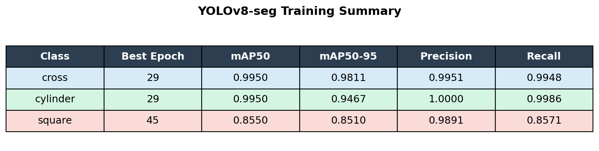

# Robot Manipulation - Bin Picking

Intel RealSense D455 카메라와 YOLOv8 segmentation 모델을 이용해 bin picking 환경에서 물체(cross, cylinder, hole)의 **3D 위치(X, Y, Z)와 orientation**을 인식하고 ROS2 토픽으로 발행하는 프로젝트입니다.

---

## 개요

공장 자동화나 로봇 pick-and-place 작업에서 물체의 위치와 방향을 정확히 알아야 그리퍼가 제대로 접근할 수 있습니다. 이 프로젝트는 RGB-D 카메라의 깊이(depth) 정보를 활용해 2D 이미지 인식을 넘어 실제 공간상의 3D 위치와 주축 방향을 뽑아냅니다.

YOLOv8 instance segmentation으로 마스크를 생성하고, 마스크 영역의 포인트클라우드를 구성한 뒤 PCA(주성분 분석)로 centroid와 orientation 축을 계산합니다.

---

## 파이프라인

```
데이터 수집             라벨링            학습               추론 (ROS2)
(data_collector.py) → (Roboflow) → (train_yolo.py) → (pose_publisher 노드)
RealSense D455         polygon seg      YOLOv8-seg        실시간 3D 위치 + orientation
```

### 단계별 설명

**1. 데이터 수집**
`data_collector.py`를 실행하면 RealSense 컬러 스트림이 뜨고, `r` 키로 0.5초 간격 자동 촬영, `s` 키로 수동 1장 저장이 됩니다.

**2. 라벨링**
수집한 이미지를 Roboflow에 업로드해 polygon segmentation 형식으로 라벨링합니다. 클래스별로 분리된 데이터셋을 export합니다.

**3. 데이터셋 병합 및 학습**
`train_yolo.py`는 개별 데이터셋을 class ID를 remapping해 하나로 합친 뒤 YOLOv8-seg를 학습합니다.

```python
model.train(
    data=yaml_path,
    epochs=100,
    imgsz=640,
    batch=16,
    device=0,
    patience=20,
)
```

**4. 실시간 추론 (ROS2)**
`pose_publisher` 노드가 컬러/뎁스 프레임을 정합(align)한 뒤 YOLO로 마스크를 생성하고 아래 순서로 3D 자세를 계산합니다.

- 마스크 영역 픽셀을 depth + 카메라 내부 파라미터로 역투영 → 포인트클라우드 (N×3)
- depth 중앙값 기준 ±5cm 이상 이상치 제거
- 포인트클라우드 centroid → 물체 **3D 위치 (X, Y, Z)**
- PCA(공분산 행렬 고유벡터 분해) → 물체 **주축 방향 (axis_x, axis_y, axis_z)**

---

## 데이터셋

### Object 모델 (cross / cylinder / hole)

| 클래스   | train | valid |
|----------|------:|------:|
| cylinder |   112 |    21 |
| hole     |   137 |    25 |
| cross    |   141 |    26 |

### Insert 모델 (cross_insert / cylinder_insert / hole_insert)


---

## 학습 결과 (Object 모델)



| Class    | mAP50 (Box) | mAP50 (Mask) | Precision | Recall |
|----------|:-----------:|:------------:|:---------:|:------:|
| cylinder |   0.9950    |    0.9950    |   0.9839  | 1.0000 |
| hole     |   0.8473    |    0.8394    |   0.9458  | 0.8571 |
| cross    |   0.9527    |    0.9527    |   0.9062  | 0.9666 |
| **mean** | **0.9317**  |  **0.9290**  | **0.9453**|**0.9412**|

---

## 실행 방법

### 의존성 설치

```bash
pip install ultralytics pyrealsense2 opencv-python numpy
```

### ROS2 빌드 및 실행

```bash
# 워크스페이스 루트에서
colcon build --packages-select vision
source install/setup.bash

# 실행 (RealSense D455 연결 필요)
ros2 run vision pose_publisher
```

### 데이터 수집 / 학습 (독립 실행)

```bash
python src/vision/scripts/data_collector.py
python src/vision/scripts/train_yolo.py
```

---

## 모드 전환 (object ↔ insert)

`pose_publisher` 노드는 두 가지 모드를 지원합니다.

| 모드 | 탐지 클래스 | ROS2 토픽 | 모델 |
|------|------------|-----------|------|
| `object` | cross, cylinder, hole | `/object_poses` | `weights/best.pt` |
| `insert` | cross_insert, cylinder_insert, hole_insert | `/insert_poses` | `weights/insert_best.pt` |

기본 모드는 `object`이며, 실행 중 ROS2 토픽으로 전환합니다.

```bash
# object 모드로 전환
ros2 topic pub --once /detect_mode std_msgs/msg/String "data: 'object'"

# insert 모드로 전환
ros2 topic pub --once /detect_mode std_msgs/msg/String "data: 'insert'"
```

현재 모드는 화면 좌상단에 `MODE: object` / `MODE: insert` 로 표시됩니다.

---

## 토픽 메시지 형식

```bash
ros2 topic echo /object_poses   # 또는 /insert_poses
```

```json
{
  "mode": "object",
  "objects": [
    {
      "class": "cross",
      "confidence": 0.923,
      "position": {"x": 0.012, "y": -0.045, "z": 0.531},
      "orientation": {
        "axis_x": [0.9981, -0.0123, 0.0601],
        "axis_y": [0.0198, 0.9934, -0.1131],
        "axis_z": [-0.0580, 0.1143, 0.9918]
      }
    }
  ]
}
```

---

## 파일 구조

```
robot_manipulation-bin-picking/
├── src/
│   └── vision/
│       ├── vision/
│       │   └── pose_publisher.py      # ROS2 노드 (3D 탐지 + 퍼블리시)
│       ├── scripts/
│       │   ├── data_collector.py      # RealSense 이미지 수집
│       │   ├── train_yolo.py          # 데이터셋 병합 + YOLOv8 학습
│       │   ├── analyze_results.py     # 학습 결과 시각화
│       │   └── eval_plot.py           # 평가 그래프
│       ├── weights/
│       │   ├── best.pt                # object 모델 (cross/cylinder/hole)
│       │   └── insert_best.pt         # insert 모델 (삽입 후 상태)
│       ├── launch/
│       │   └── pose_publisher.launch.py
│       ├── package.xml
│       └── setup.py
├── training_summary_table.png
└── insert_summary_table.png
```

---

## 개발 환경

- Python 3.10
- ROS2 Humble
- Intel RealSense D455
- Ultralytics YOLOv8-seg
- pyrealsense2, OpenCV, NumPy
- CUDA GPU (NVIDIA GeForce RTX 4060 Laptop)
